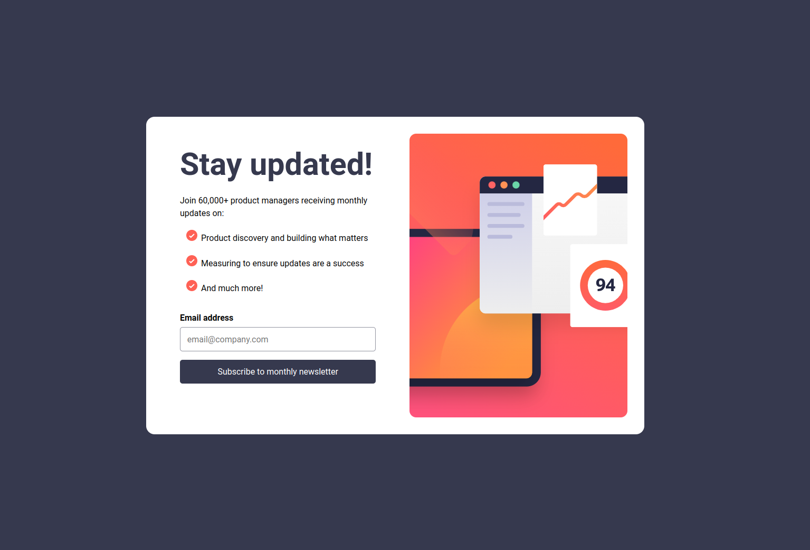

# Frontend Mentor - Newsletter Sign Up

## Table of contents

- [Overview](#overview)
  - [The challenge](#the-challenge)
  - [Screenshot](#screenshot)
  - [Links](#links)
- [My process](#my-process)
  - [Built with](#built-with)
  - [What I learned](#what-i-learned)
- [Author](#author)

## Overview

### The challenge

Your users should be able to:

- Add their email and submit the form
- See a success message with their email after successfully submitting the form
- See form validation messages if:
   - The field is left empty
   - The email address is not formatted correctly

- View the optimal layout for the interface depending on their device's screen size
- See hover and focus states for all interactive elements on the page

### Screenshot



### Links

- Solution URL: [Github Repo](https://github.com/Gnandal/newsletter_signup)
- Live Site URL: [Demo](https://gnandal.github.io/newsletter_signup)

## My process

### Built with

- Semantic HTML5 markup
- CSS custom properties
- Flexbox
- Mobile-First Flow
- JavaScript

### What I learned

Here are what I learned :

- Style unorder list (ul) :
```css
ul {
  list-style: url("./assets/images/icon-list.svg");
}
```

- Email validation :
```js
const emailRegex = new RegExp(/^[A-Za-z0-9_!#$%&'*+\/=?`{|}~^.-]+@[A-Za-z0-9.-]+$/, "gm");
```

## Author

- Website - [GNANDAL  ELISEE](https://gnandal-elisee.vercel.app)
- Frontend Mentor - [@Gnandal](https://www.frontendmentor.io/profile/Gnandal)
